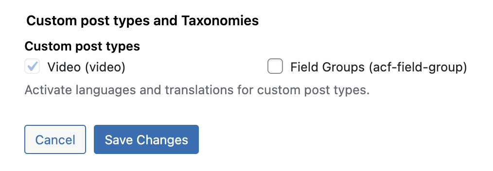

# Translatable custom post types (Polylang)

Polylang settings enable feature where you can define translatable post types on settings page via checkbox option. Better way to define which post types are translatable is to make it programmatically. That ensures that the settings are same in all environments and they can be changed only on code level.

## What to do?

List desired post types in function `add_cpt_to_pll`.
